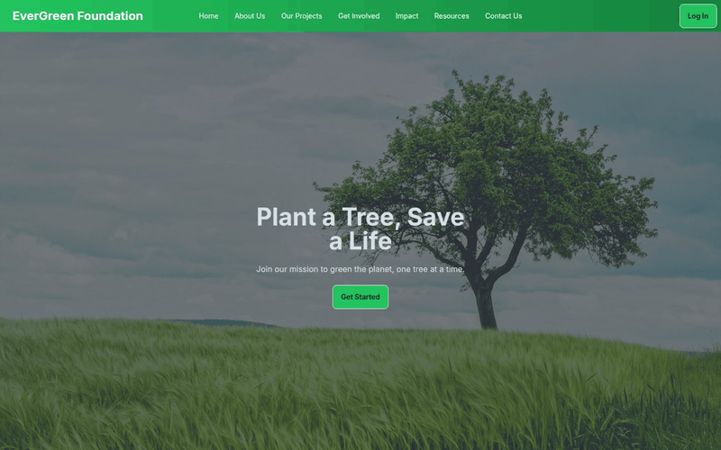
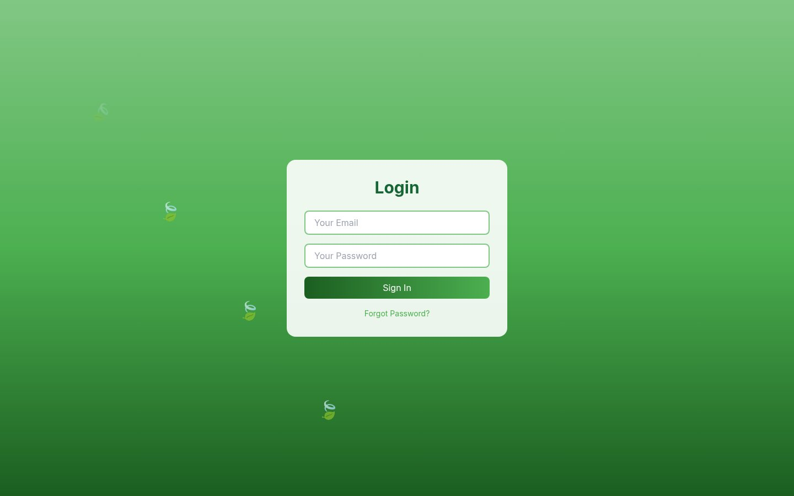
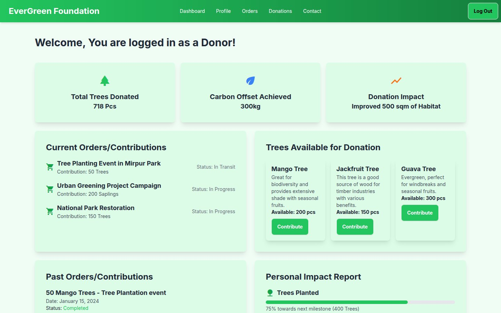
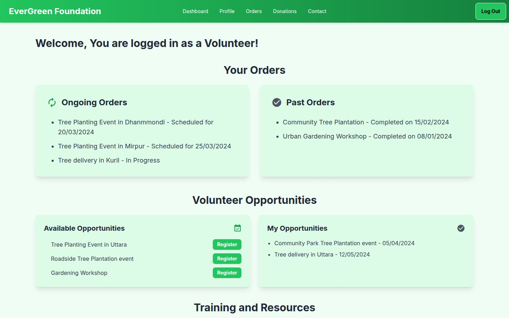

# EverGreen Foundation

A static UI prototype for a tree-planting nonprofit: a public landing page, a login screen and dashboards for four kinds of users.

**Live site:** <https://shayan-abrar.github.io/EverGreen-Foundation-without-js-/>

<p align="center">
  
</p>

<table>
  <tr>
    <td align="center" width="20%"><a href="screenshots/home.jpg"></a><br><sub><b>Landing</b></sub></td>
    <td align="center" width="20%"><a href="screenshots/login.jpg"></a><br><sub><b>Login</b></sub></td>
    <td align="center" width="20%"><a href="screenshots/admin-dashboard.png"></a><br><sub><b>Admin</b></sub></td>
    <td align="center" width="20%"><a href="screenshots/donor-dashboard.jpg"></a><br><sub><b>Donor</b></sub></td>
    <td align="center" width="20%"><a href="screenshots/volunteer-dashboard.jpg"></a><br><sub><b>Volunteer</b></sub></td>
  </tr>
</table>

A reforestation charity serves several audiences: people who donate, people who volunteer, members following their own impact, and the staff who run it. This prototype sketches what each of them would see, with a shared green design system across six pages, before any backend exists. It's plain HTML with Tailwind CSS and DaisyUI, and it has no custom JavaScript.

## Quick Start

```bash
git clone https://github.com/SHAYAN-ABRAR/EverGreen-Foundation-without-js-.git
cd EverGreen-Foundation-without-js-
python3 -m http.server 8000
```

Open <http://localhost:8000> for the landing page. The pages aren't linked to each other, so open the others by name, for example <http://localhost:8000/admin.html>. On Windows, use `python` instead of `python3`. Tailwind CSS, DaisyUI and Material Icons load from CDNs, so you need an internet connection.

## Pages

| Page | File | Live | What it shows |
| --- | --- | --- | --- |
| Landing | [`index.html`](index.html) | [open](https://shayan-abrar.github.io/EverGreen-Foundation-without-js-/) | Hero, About Us, projects, Get Involved, impact stats, news and resources, FAQ accordion |
| Login | [`login.html`](login.html) | [open](https://shayan-abrar.github.io/EverGreen-Foundation-without-js-/login.html) | Email and password form |
| Admin | [`admin.html`](admin.html) | [open](https://shayan-abrar.github.io/EverGreen-Foundation-without-js-/admin.html) | Donation and user totals, user activity feed, user feedback, settings shortcuts |
| Donor | [`donor.html`](donor.html) | [open](https://shayan-abrar.github.io/EverGreen-Foundation-without-js-/donor.html) | Trees donated, carbon offset, current and past contributions, trees available to sponsor, impact report, certificates |
| User | [`user.html`](user.html) | [open](https://shayan-abrar.github.io/EverGreen-Foundation-without-js-/user.html) | Personal impact, recent donations, milestones, next year's goals, a planting-location dropdown, past orders |
| Volunteer | [`volunteer.html`](volunteer.html) | [open](https://shayan-abrar.github.io/EverGreen-Foundation-without-js-/volunteer.html) | Orders, volunteer opportunities, training modules, resource library, schedule and time tracking, rewards, reports |

## Features

- **Six standalone pages** that share one navbar style, green palette, card layout and footer.
- **Role-based dashboards:** each dashboard groups the information that one kind of user would need, with sample data.
- **DaisyUI components:** the FAQ accordion on the landing page, buttons throughout, and a select menu on the user dashboard. The progress bars are plain Tailwind-styled bars.
- **Material Icons** for card and section headings.
- **Breakpoints:** card grids use Tailwind prefixes such as `md:grid-cols-3` to show more columns on wider screens.

## Limitations

This is a front-end prototype. The login form doesn't sign anyone in, the pages don't link to each other, and every figure, name and order on the dashboards is sample data written into the HTML. The photos in `image/` are full-resolution files (up to about 7 MB each), so the landing page is slow to load. The certificate cards on the donor dashboard point to background images (`certificate-bg-1.jpg` to `certificate-bg-3.jpg`) that aren't in the repository, so they appear without backgrounds.

## Tech Stack

- HTML5 (six standalone pages)
- Tailwind CSS (Play CDN) and DaisyUI 4.7.2
- Google Material Icons
- Hosted on GitHub Pages

## Contributing

Suggestions and bug reports are welcome. Please [open an issue](https://github.com/SHAYAN-ABRAR/EverGreen-Foundation-without-js-/issues). Please read the license note below before reusing any code or images.

## License

This repository doesn't have a license yet, so it doesn't grant anyone permission to reuse or redistribute its code or images. Please ask before reusing any part of it.

---

Built by **Shayan Abrar** · [GitHub](https://github.com/SHAYAN-ABRAR) · [LinkedIn](https://www.linkedin.com/in/shayan-abrar/)
