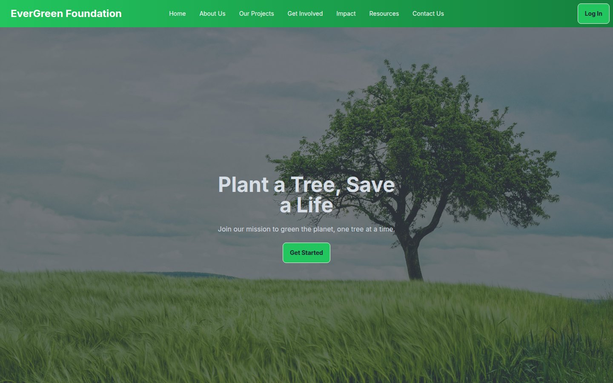
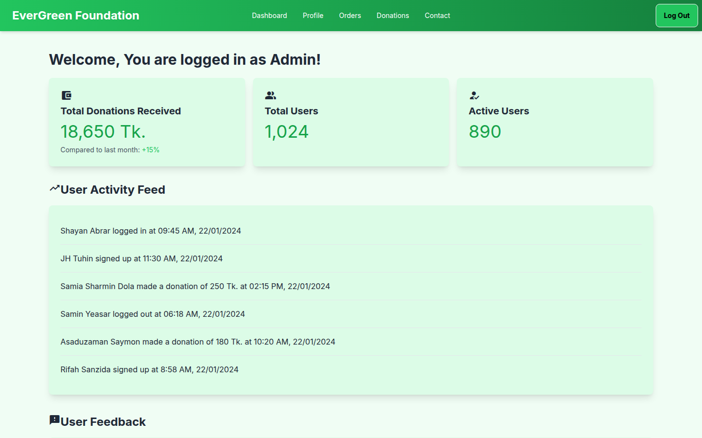

# EverGreen Foundation — Reforestation Nonprofit UI

A multi-page, static UI prototype for a tree-planting nonprofit. It includes a public landing page, a login screen and four role-based dashboards (Admin, Donor, User and Volunteer). Everything is built with HTML and Tailwind CSS, with no JavaScript.

[](https://shayan-abrar.github.io/EverGreen-Foundation-without-js-/) <!-- live-demo -->




## Pages

| Page | File | What it shows |
| --- | --- | --- |
| Landing | `index.html` | Hero, About Us, projects, Get Involved (donate / volunteer), impact stats, news and resources, FAQ |
| Login | `login.html` | Email and password sign-in form |
| Admin dashboard | `admin.html` | Donation and user KPIs, user activity feed, user feedback, settings shortcuts |
| Donor dashboard | `donor.html` | Trees donated, carbon offset, current and past contributions, trees available to sponsor |
| User dashboard | `user.html` | Personal impact, recent donations, milestones, yearly goals, planting-location picker |
| Volunteer dashboard | `volunteer.html` | Assigned orders, volunteer opportunities, training modules, resource library, schedule |



## Highlights

- Consistent design system across six pages: a green brand palette, card-based KPIs and Material Icons
- Role-based dashboards that model what each type of user needs to see
- Responsive layouts using Tailwind CSS utilities and DaisyUI components (such as the FAQ accordion)
- Pure HTML/CSS, so it's easy to hand off to a backend for real authentication and data

## Tech Stack

| Layer | Technology |
| --- | --- |
| Markup | HTML5 (multi-page) |
| Styling | Tailwind CSS (Play CDN), DaisyUI 4 |
| Icons | Google Material Icons |
| Hosting | GitHub Pages |

## Project Structure

```text
EverGreen-Foundation-without-js-/
├── index.html        # Public landing page
├── login.html        # Sign-in screen
├── admin.html        # Admin dashboard
├── donor.html        # Donor dashboard
├── user.html         # User dashboard
├── volunteer.html    # Volunteer dashboard
├── image/            # Hero, project and news images
└── tailwind.config.js
```

## Run Locally

```bash
git clone https://github.com/SHAYAN-ABRAR/EverGreen-Foundation-without-js-.git
cd EverGreen-Foundation-without-js-
# Open index.html, or any dashboard file, directly in a browser
```

Each page is a standalone HTML file. Tailwind CSS, DaisyUI and Material Icons load from CDNs.

## Future Improvements

- Connect the login form to a backend and route each role to its dashboard
- Replace the sample dashboard data with live data from an API
- Add a donation checkout flow

## Author

**Shayan Abrar** · [GitHub](https://github.com/SHAYAN-ABRAR) · [LinkedIn](https://www.linkedin.com/in/shayan-abrar/) · [Portfolio](https://shayan-abrar.vercel.app)
